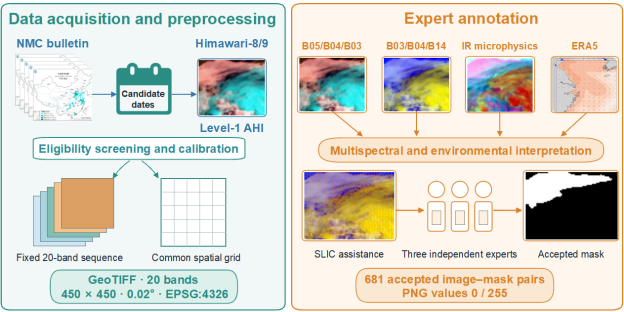

# East China Sea Event-Based Daytime Sea-Fog Dataset

This repository provides the processing, annotation and quality-control code, together with the machine-readable metadata and frozen validation summaries, for the **East China Sea event-based daytime sea-fog image and mask dataset (2020–2023)**.

The dataset contains **681 georeferenced image–mask pairs** derived from daytime Himawari-8/9 Advanced Himawari Imager (AHI) observations. Candidate dates were identified from sea-fog information issued by the National Meteorological Center of China and were used only to guide satellite-data retrieval. NMC bulletins were not used as pixel-level labels.



## Data access

- Zenodo record: <https://doi.org/10.5281/zenodo.21847718>
- Intended release: version `1.0.0`
- Dataset licence: [Creative Commons Attribution–NonCommercial 4.0 International](https://creativecommons.org/licenses/by-nc/4.0/) (`CC BY-NC 4.0`)
- Current repository status: the DOI is reserved but was not publicly resolvable when this README was prepared. Replace this sentence with the public release date after the Zenodo record is published.

The original P-Tree NetCDF files are not redistributed. The released GeoTIFF images and PNG masks are author-processed research products and are not official products of the Japan Aerospace Exploration Agency (JAXA) or the Japan Meteorological Agency (JMA). Processed Himawari-8/9 AHI data in the Zenodo deposit are redistributed with permission from JMA and remain subject to the applicable terms of that permission.

## Dataset composition

| Archive | Platform | Image–mask pairs | Size |
|---|---|---:|---:|
| `2020.zip` | Himawari-8 | 158 | 1.94 GB |
| `2021.zip` | Himawari-8 | 141 | 1.77 GB |
| `2022.zip` | Himawari-8 | 244 | 3.00 GB |
| `2023.zip` | Himawari-9 | 138 | 1.69 GB |
| **Total** |  | **681** | **8.39 GB** |

Each record consists of one LZW-compressed, 20-band, Float32 GeoTIFF image and one spatially corresponding, single-channel, 8-bit PNG mask. Images and masks are 450 × 450 pixels. The GeoTIFF images cover 119° E–128° E and 27° N–36° N on a regular 0.02° latitude–longitude grid and use WGS 84 (`EPSG:4326`). Mask value `0` denotes non-sea-fog pixels and `255` denotes expert-accepted sea-fog pixels.

The GeoTIFF band order is fixed:

- bands 1–6: dimensionless top-of-atmosphere albedo for AHI B01–B06;
- bands 7–16: brightness temperature in kelvin for AHI B07–B16; and
- bands 17–20: satellite azimuth, satellite zenith, solar azimuth and solar zenith angles in degrees.

See [`metadata/band_dictionary.csv`](metadata/band_dictionary.csv) for the complete machine-readable band dictionary.

## Repository contents

```text
.
├── README.md
├── CITATION.cff
├── LICENSE_NOTICE.md
├── requirements.txt
├── H8_seafog_label.py
├── docs/
│   └── construction_workflow.png
├── scripts/
│   ├── preprocess_himawari_l1.py
│   ├── annotate_sea_fog.py
│   ├── verify_dataset.py
│   └── calculate_validation_metrics.py
├── metadata/
│   ├── archive_inventory.csv
│   ├── band_dictionary.csv
│   ├── event_catalogue_2020_2023.csv
│   ├── file_manifest_2020_2023.csv
│   ├── SHA256SUMS_archives.txt
│   └── SHA256SUMS_images_masks.txt
└── validation/
    ├── README.md
    ├── validation_confusion_counts.csv
    └── validation_metrics.csv
```

`file_manifest_2020_2023.csv` contains one row per released image–mask pair and records the scene identifier, UTC acquisition time, relative paths, raster structure, mask values and SHA-256 checksums. `event_catalogue_2020_2023.csv` is a date-level catalogue; its rows must not be interpreted as statistically independent meteorological events. The two checksum lists record the frozen local hashes; the four archive hashes should be checked again against the final public Zenodo files after publication.

## Processing and annotation

The processing script converts JAXA P-Tree Himawari Level-1 gridded NetCDF variables to the fixed 20-band GeoTIFF structure and crops them to the published East China Sea grid. The visible and near-infrared albedo variables are decoded using the NetCDF scaling and correction attributes; the thermal-infrared bands and viewing geometry are decoded using their scale and offset attributes.

The annotation interface displays three complementary AHI visualisations: B05/B04/B03, B03/B04/B14 and an infrared-microphysics composite. Each displayed component is stretched independently between its 2nd and 98th percentiles for visual interpretation only. SLIC superpixels assist boundary delineation. Coastal-station, ICOADS and CALIOP observations are deliberately excluded from the annotation interface because they are reserved for independent technical validation. ERA5 fields are environmental context examined separately by the experts and are not incorporated into the released GeoTIFF images or masks.

The graphical interface supports candidate-mask production. Independent review by two meteorological experts and third-expert adjudication are controlled human-review stages and are not automatically performed by the software.

## Installation

Python 3.10 or later is recommended.

```bash
python -m pip install -r requirements.txt
```

GDAL must be available through Rasterio and NetCDF4 on the host system. The annotation interface also requires a desktop environment with Tk support.

## Usage

Convert a directory of P-Tree Level-1 NetCDF scenes:

```bash
python scripts/preprocess_himawari_l1.py INPUT_NC_DIRECTORY OUTPUT_TIF_DIRECTORY
```

Open the SLIC-assisted annotation interface:

```bash
python scripts/annotate_sea_fog.py
```

Check the frozen manifest and date-level catalogue:

```bash
python scripts/verify_dataset.py \
  --manifest metadata/file_manifest_2020_2023.csv \
  --catalogue metadata/event_catalogue_2020_2023.csv
```

If the four annual archives have been extracted, add `--dataset-root PATH --verify-hashes` to check the actual GeoTIFF and PNG files and write a scene-level audit CSV.

Recalculate the reported validation metrics from the frozen confusion-matrix counts:

```bash
python scripts/calculate_validation_metrics.py \
  validation/validation_confusion_counts.csv \
  validation/validation_metrics.csv
```

## Independent validation records

The repository provides aggregate results matching the manuscript. It does not redistribute the original third-party coastal-station, ICOADS or CALIOP records. Surface records were subjected to spatiotemporal matching, quality control and the effective-count processing defined in the manuscript. CALIOP is reported as a separate, spatially limited profile-level validation source.

| Source | H | M | F | C | n | ACC (%) | PRE (%) | REC (%) | CSI (%) |
|---|---:|---:|---:|---:|---:|---:|---:|---:|---:|
| Coastal stations | 306 | 41 | 71 | 21,276 | 21,694 | 99.48 | 81.17 | 88.18 | 73.21 |
| ICOADS | 89 | 12 | 7 | 1,453 | 1,561 | 98.78 | 92.71 | 88.12 | 82.41 |
| CALIOP | 191 | 105 | 29 | 734 | 1,059 | 87.35 | 86.82 | 64.53 | 58.77 |

## Citation

Until the Zenodo record is published, cite the reserved dataset record as:

> Kang, X., Li, Y., Wu, N., Fu, R. & Jin, W. *An event-based daytime sea-fog image and mask dataset for the East China Sea from 2020 to 2023*, version 1.0.0. Zenodo. <https://doi.org/10.5281/zenodo.21847718> (2026).

The final citation should be copied from the public Zenodo landing page after publication. If the dataset version changes, cite the version-specific DOI associated with the files actually used.

## Authors

Xiao Kang and Yuejun Li contributed equally. The author order is Xiao Kang, Yuejun Li, Nan Wu, Randi Fu and Wei Jin.

Questions and reproducibility reports may be submitted through the GitHub issue tracker.
